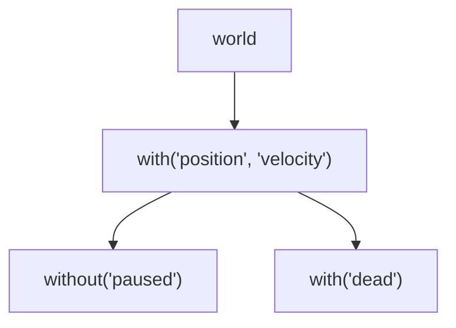

# Advanced Usage

## Nested Archetypes

Archetypes are the main way to query entities in Miniplex. They are created by calling the `with` method on a world, and can be thought of as something akin to database indices.

Next to `with`, there is also `without`, which creates an archetype that matches entities that do _not_ have any of the specified components.

`with` and `without` can be nested:

```ts
const movable = world.with("position", "velocity")
const movableAndActive = movable.without("paused")
const movableAndDead = movable.with("dead")
```

It is very important to understand that this will create _three_ archetypes; one that matches entities that have both `position` and `velocity`, another that matches entities from the first archetype that also do not have the `paused` component, and a third that matches entities from the first archetype that also have the `dead` component.



Every time an entity is added to the world or has a component added or removed, all relevant archetypes are updated and asked to re-evaluate the changed entity. This update trickles down to all archetypes, and stops with archetypes that reject the entity.

In larger projects, the structure of your archetype waterfall can have a significant impact on performance; in some cases, it can be beneficial to create a large number of small, nested archetypes, while in other cases it can be beneficial to create fewer, larger archetypes.

## Combining `with` and `without` queries

You can create a combined query that looks for both the presence as well as the absence of specific components through the `archetype` function:

```ts
const movableAndActive = world.archetype({
  with: ["position", "velocity"],
  without: ["paused"]
})
```

This will create a single archetype wrapping the two queries, matching entities that have both `position` and `velocity` components, but do not have the `paused` component.
