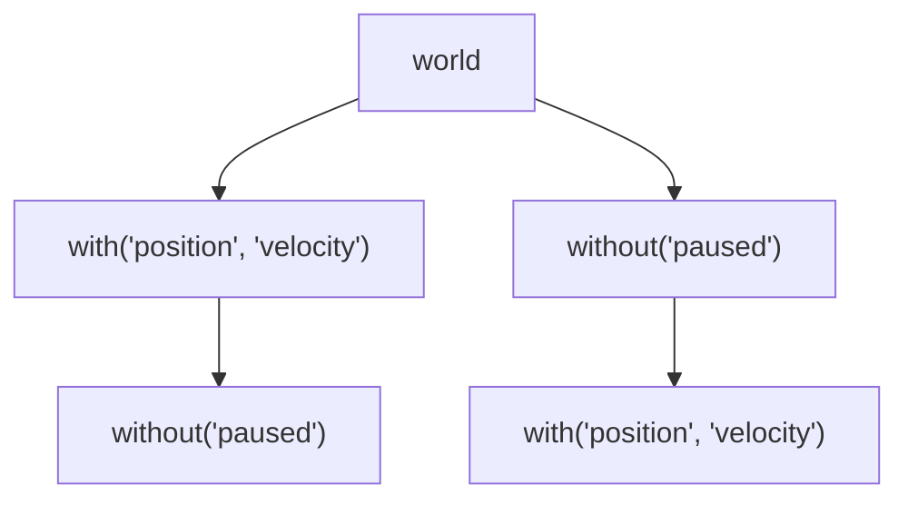

## Best Practices

### Use `addComponent` and `removeComponent` for adding and removing components

Since entities are just normal objects, you might be tempted to just add new properties to (or delete properties from) them directly. **This is a bad idea** because it will skip the indexing step needed to make sure the entity is listed in the correct archetypes. Please always go through `addComponent` and `removeComponent`!

It is perfectly fine to mutate component _values_ directly, though.

```ts
/* ✅ This is fine: */
const entity = world.add({ position: { x: 0, y: 0, z: 0 } })
entity.position.x = 10

/* ⛔️ This is not: */
const entity = world.add({ position: { x: 0, y: 0, z: 0 } })
entity.velocity = { x: 10, y: 0, z: 0 }
```

### Iterate over archetypes using `for...of`

The world as well as all archetypes derived from it are _iterable_, meaning you can use them in `for...of` loops. This is the recommended way to iterate over entities in an archetype, as it is highly performant, and iterates over the entities _in reverse order_, which allows you to safely remove entities from within the loop.

```ts
const withHealth = world.archetype("health")

/* ✅ Recommended: */
for (const entity of withHealth) {
  if (entity.health <= 0) {
    world.remove(entity)
  }
}

/* ⛔️ Avoid: */
for (const entity of withHealth.entities) {
  if (entity.health <= 0) {
    world.remove(entity)
  }
}

/* ⛔️ Especially avoid: */
withHealth.entities.forEach((entity) => {
  if (entity.health <= 0) {
    world.remove(entity)
  }
})
```

### Reuse archetypes where possible

The `archetype` function and its shorthand friends (`with`, `without`) aim to be idempotent and will reuse existing archetypes for the same queries passed to them. Checking if an archetype already exists for the given query is a comparatively heavyweight function, thought, and you are advised to, wherever possible, reuse previously created archetypes.

```ts
/* ✅ Recommended: */
const movingEntities = world.archetype("position", "velocity")

function movementSystem() {
  for (const { position, velocity } of movingEntities) {
    position.x += velocity.x
    position.y += velocity.y
    position.z += velocity.z
  }
}

/* ⛔️ Avoid: */
function movementSystem(world) {
  /* This will work, but now the world needs to check if an archetype for "position" and "velocity" already exists every time this function is called, which is pure overhead. */
  const movingEntities = world.archetype("position", "velocity")

  for (const { position, velocity } of movingEntities) {
    position.x += velocity.x
    position.y += velocity.y
    position.z += velocity.z
  }
}
```

### Create nested archetypes with caution

Miniplex does not optimize queries automatically, so the following code will create more archetypes than you probably need:

```ts
const a = world.with("position", "velocity").without("paused")
const b = world.without("paused").with("position", "velocity")
```

Now `a` and `b` contain exactly the same entities, but they are in fact two completely separate branches of the archetype tree:



Everything will still work fine, but now the system is unnecessarily doing work twice.

> **Note** A future version of Miniplex will likely include a way to optimize cases like this automatically, but for now, you should be careful when creating nested archetypes.
